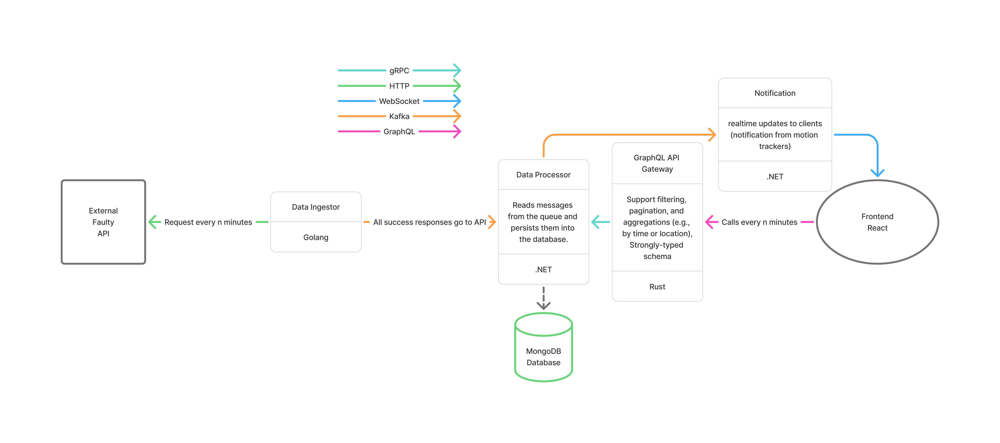

# Smart Building Metrics Platform

A microservice-based application that ingests sensor metrics from an unstable upstream API, stores them in MongoDB, exposes them through a GraphQL gateway, and delivers real-time motion notifications to a React dashboard.

## Architecture



### Services

| Service | Role | Tech |
|---------|------|------|
| [WeakApp/](WeakApp/) | Unstable upstream API that serves meter readings | — |
| [DataIngestor/](DataIngestor/) | Polls WeakApp and publishes validated data to Kafka | Go |
| [DataProcessor/](DataProcessor/) | Consumes Kafka messages, persists metrics to MongoDB, exposes gRPC | .NET |
| [GraphQLAPIGateway/](GraphQLAPIGateway/) | GraphQL read API backed by DataProcessor gRPC | Rust |
| [NotificationsService/](NotificationsService/) | Consumes motion events from Kafka and pushes them via SignalR | .NET |
| [frontend/](frontend/) | Dashboard SPA for metrics and live motion alerts | React |

### Infrastructure (Docker Compose)

| Component | Purpose | Port |
|-----------|---------|------|
| `mongodb` | Metric storage | 27017 |
| `broker` | Apache Kafka message broker | 9092 |
| `control-center` | Kafdrop UI for inspecting Kafka topics | 9000 |

## Quick Start

### Prerequisites

- Docker and Docker Compose
- A valid `WEAKAPP_API_KEY` for the upstream WeakApp API

### 1. Configure environment

From the repository root:

```bash
cp .env.example .env
```

Edit `.env` and set `WEAKAPP_API_KEY`. Other variables have sensible defaults for local Docker Compose.

### 2. Start the stack

```bash
docker compose up --build
```

This starts all services defined in [`docker-compose.yaml`](docker-compose.yaml). On Windows, `docker-compose.override.yaml` is applied automatically for local development settings.

### 3. Open the application

| URL | Description |
|-----|-------------|
| [http://localhost:3000](http://localhost:3000) | Frontend dashboard |
| [http://localhost:4000/graphiql](http://localhost:4000/graphiql) | GraphQL playground |
| [http://localhost:9000](http://localhost:9000) | Kafdrop (Kafka UI) |
| [http://localhost:8080/health](http://localhost:8080/health) | WeakApp health check |

### Useful commands

```bash
# Start in the background
docker compose up --build -d

# View logs for a single service
docker compose logs -f data-processor

# Stop and remove containers
docker compose down
```

## Data Flow

1. **DataIngestor** polls WeakApp on a configurable interval and publishes meter readings to the `meter-data` Kafka topic.
2. **DataProcessor** consumes those messages, upserts rooms, and stores air quality, energy, and motion records in MongoDB.
3. When motion is detected, **DataProcessor** publishes a notification to the `motion-events` Kafka topic.
4. **GraphQLAPIGateway** serves historical and aggregated metrics to the frontend over GraphQL (backed by DataProcessor gRPC).
5. **NotificationsService** consumes `motion-events` and broadcasts them to connected browsers via SignalR.
6. **frontend** queries GraphQL for charts and tables, and listens on the SignalR hub for live motion toasts and status updates.

## Service Documentation

- [DataIngestor/README.md](DataIngestor/README.md)
- [DataProcessor/README.md](DataProcessor/README.md)
- [GraphQLAPIGateway/README.md](GraphQLAPIGateway/README.md)
- [NotificationsService/README.md](NotificationsService/README.md)
- [frontend/README.md](frontend/README.md)
